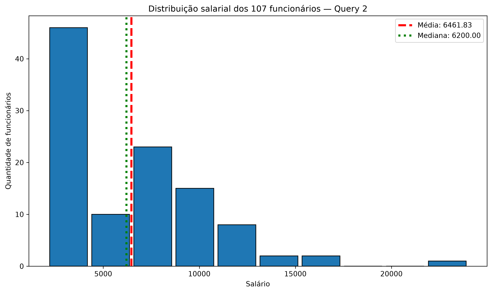
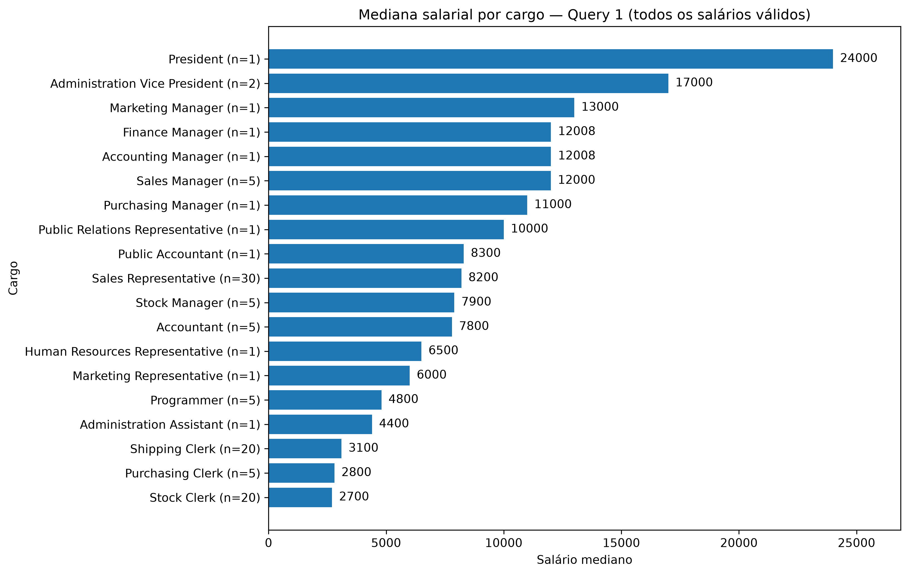
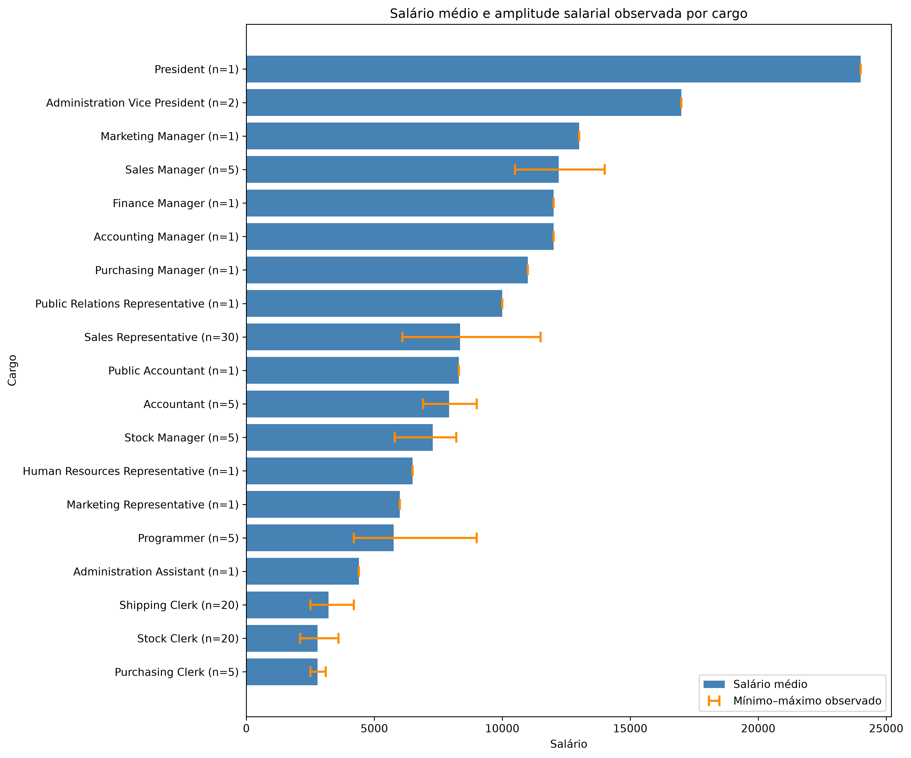
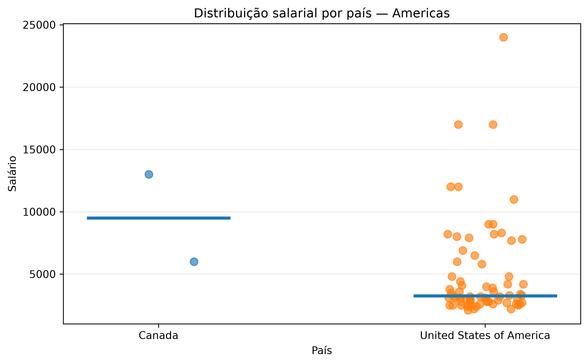
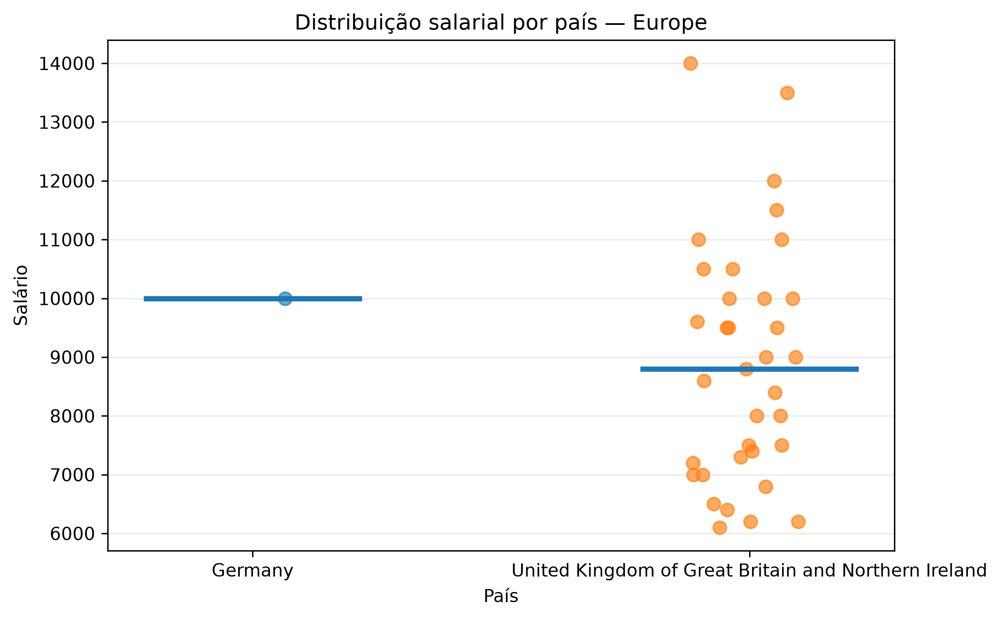

# Análise de RH com SQL e Python

**Aluno:** José Humberto de Souza
**Turma:** VISUALIZAÇÃO DE DADOS E BUSINESS INTELLIGENCE [T3]

## Organização do projeto

O desenvolvimento deste trabalho foi organizado no **Trello**, utilizando cartões e etapas para acompanhar as atividades do projeto, desde a definição das consultas SQL até a análise exploratória, geração dos gráficos, documentação e validação final.

O quadro também foi utilizado para orientar as sprints e registrar a evolução das entregas.

**Quadro do projeto no Trello:**  
https://trello.com/b/uI9OSd7e/projeto-avaliativo-an%C3%A1lise-de-rh-com-sql-e-python

**Diagrama completo da arquitetura do projeto, mostrando o fluxo desde o planejamento até a entrega final**  
https://whimsical.com/jose-s-workspace48/arquitetura-do-projeto-analise-de-rh-com-sql-e-python-9RVe89W1LL3Wc9MunrzZqu

## Objetivo do projeto

Este projeto tem como objetivo analisar dados de Recursos Humanos com foco em funcionários, cargos, departamentos, salários e distribuição geográfica. O trabalho utiliza consultas SQL para extração dos dados e Python para realizar análise exploratória, cálculos estatísticos e visualizações.

A análise busca compreender principalmente:

- a distribuição dos salários;
- a relação entre cargos, departamentos e remuneração;
- os padrões salariais observados entre regiões e países;
- as diferenças entre média e mediana na interpretação dos salários.

## Ferramentas utilizadas

- **FreeSQL — schema Human Resources (HR):** consulta e extração dos dados;
- **SQL:** construção das consultas e relacionamentos entre as tabelas;
- **Python:** análise exploratória e estatística;
- **Pandas:** manipulação e análise dos dados;
- **Matplotlib:** criação e exportação dos gráficos;
- **VS Code:** desenvolvimento e execução do projeto;
- **Git e GitHub:** controle de versão e publicação do repositório.

## Consultas utilizadas

### Query 1 — Salários por departamento e cargo

A Query 1 relaciona as tabelas de funcionários, departamentos e cargos. O objetivo é analisar os salários por departamento e cargo, além de comparar os salários observados com as faixas mínima e máxima cadastradas para cada cargo.

Foi utilizado o filtro:

`SALARIO > 0`

O resultado contém **107 funcionários**, contemplando todos os registros com salários válidos e permitindo uma análise completa da distribuição salarial por cargo.

### Query 2 — Funcionários por região e localização

A Query 2 relaciona funcionários, departamentos, localizações, países e regiões. Seu objetivo é permitir uma análise mais ampla dos salários e de sua distribuição geográfica.

Foi utilizado o filtro:

`SALARIO > 0`

O resultado contém **107 funcionários** e permite analisar salário, departamento, cidade, estado, país e região.

## Estrutura do repositório

O projeto está organizado da seguinte forma:

```text
projeto-rh-sql-python/
├── data/
│   └── raw/
│       ├── query_01.csv
│       └── query_02.csv
├── outputs/
│   └── graficos/
│       ├── s4_1_distribuicao_salarial.png
│       ├── s4_2_salarios_por_cargo.png
│       ├── s4_3_salarios_pais_americas.png
│       └── s4_3_salarios_pais_europe.png
├── sql/
│   ├── query_1.sql
│   └── query_2.sql
├── src/
│   └── analise_rh.py
├── README.md
└── requirements.txt
```

### Função das principais pastas

- **data/raw/** — contém os arquivos CSV exportados a partir das consultas SQL.
- **sql/** — contém as duas consultas executadas para extração dos dados.
- **src/** — contém o script Python responsável pela análise exploratória, cálculos estatísticos e geração dos gráficos.
- **outputs/graficos/** — contém as visualizações finais exportadas pelo script Python.
- **requirements.txt** — registra as principais bibliotecas utilizadas no projeto.
- **README.md** — documenta o objetivo, metodologia, resultados e instruções para execução do projeto.


## Mapeamento inicial das tabelas HR

### Consulta de salários por departamento e cargo
- `HR.EMPLOYEES` é a tabela principal.
- `EMPLOYEES.DEPARTMENT_ID` se relaciona com `DEPARTMENTS.DEPARTMENT_ID`.
- `EMPLOYEES.JOB_ID` se relaciona com `JOBS.JOB_ID`.

### Consulta de funcionários por região e localização
- `EMPLOYEES.DEPARTMENT_ID` → `DEPARTMENTS.DEPARTMENT_ID`
- `DEPARTMENTS.LOCATION_ID` → `LOCATIONS.LOCATION_ID`
- `LOCATIONS.COUNTRY_ID` → `COUNTRIES.COUNTRY_ID`
- `COUNTRIES.REGION_ID` → `REGIONS.REGION_ID`
## Origem e extração dos dados

Os dados são provenientes do esquema de exemplo Human Resources (HR),
consultado no Oracle FreeSQL, para fins educacionais.

As consultas SQL estão armazenadas em `sql/`. Seus resultados foram
exportados em CSV pelo FreeSQL e salvos em `data/raw/`.

## Arquivos disponíveis

### Estrutura das consultas

| Consulta | Arquivo SQL | Arquivo CSV | Registros | Colunas |
| --- | --- | --- | ---: | ---: |
| Query 1 | `sql/query_1.sql` | `data/raw/query_01.csv` | 107 | 7 |
| Query 2 | `sql/query_2.sql` | `data/raw/query_02.csv` | 107 | 8 |

### Query 1 — Salários, departamentos e cargos

A Query 1 seleciona todos os funcionários com salário maior que zero.

Ela inclui departamento, cargo e as faixas mínima e máxima cadastradas para cada cargo, com ordenação por salário decrescente.

Com a correção do filtro, a Query 1 passou a contemplar os **107 funcionários com salários válidos**, permitindo analisar a distribuição salarial por cargo sem restringir a análise aos maiores salários.

### Relação entre as duas consultas

As duas consultas utilizam a mesma base de funcionários e contêm 107 registros com salários válidos.

A Query 1 concentra as informações de cargo e faixa salarial, enquanto a Query 2 concentra as informações geográficas.

O cruzamento das consultas pelo campo `EMPLOYEE_ID` apresentou correspondência para os 107 funcionários, sem divergências nos valores de salário.

### Query 2 — Localização dos departamentos dos funcionários

Seleciona funcionários com salário maior que zero.
Inclui departamento, cidade, estado, país e região.

A localização corresponde ao departamento ao qual o funcionário
está vinculado, não necessariamente ao seu local de residência.

## Preservação e uso dos dados

- Os CSVs em `data/raw/` são preservados sem limpeza ou edição manual dos dados.
- Campos vazios da exportação devem ser mantidos nos arquivos originais.
- Futuras versões tratadas serão armazenadas em `data/processed/`.
- Os dois resultados contêm funcionários em comum. Não devem ser
  simplesmente concatenados para calcular estatísticas gerais.
- A moeda dos salários não foi confirmada; os valores não são
  apresentados como reais (R$).


## Preparação do ambiente Python

### Objetivo

Preparar um ambiente de desenvolvimento Python no VS Code para realizar a análise exploratória dos dados extraídos do FreeSQL.

O ambiente utiliza bibliotecas para manipulação de dados, cálculos estatísticos e geração de gráficos.


### Criação do ambiente virtual

O ambiente virtual permite instalar e utilizar bibliotecas específicas para o projeto, mantendo suas dependências separadas de outros projetos Python.

No terminal PowerShell, a partir da pasta raiz do projeto, executar:

```powershell
py -m venv .venv
```

Para ativar o ambiente virtual no Windows:

```powershell
.\.venv\Scripts\Activate.ps1
```

Após a ativação, o terminal deverá apresentar o identificador `(.venv)`.

No VS Code, selecionar o interpretador Python localizado em:

`.venv\Scripts\python.exe`

### Instalação das dependências

As bibliotecas necessárias ao projeto estão registradas no arquivo `requirements.txt`.

Com o ambiente virtual ativado, executar:

```powershell
python -m pip install -r requirements.txt
```

O comando instala as dependências e suas respectivas versões, permitindo reproduzir o ambiente utilizado no desenvolvimento.

As principais bibliotecas instaladas são:

| Biblioteca | Versão |
| --- | --- |
| Pandas | 3.0.6 |
| Matplotlib | 3.11.2 |
| NumPy | 2.5.3 |
O arquivo `requirements.txt` contém também as demais dependências instaladas no ambiente utilizado no desenvolvimento.

### Teste de reprodução do ambiente

Para verificar se o ambiente poderia ser reconstruído a partir do arquivo `requirements.txt`, foi criado um ambiente virtual temporário denominado `.venv-teste`.

A instalação das dependências foi realizada utilizando diretamente o interpretador desse ambiente:

```powershell
.\.venv-teste\Scripts\python.exe -m pip install -r requirements.txt
```

Após a instalação, foram testadas as importações das bibliotecas Pandas, Matplotlib e Seaborn.

O teste confirmou o funcionamento das três bibliotecas e retornou as versões esperadas.

Depois da validação, o ambiente temporário foi removido, preservando o ambiente principal `.venv`.

### Controle de arquivos com .gitignore

O arquivo `.gitignore` contém regras para impedir o versionamento de ambientes virtuais, arquivos temporários e configurações locais.

Entre os diretórios e arquivos ignorados estão:

- `.venv/`: ambiente virtual principal.
- `.venv-teste/`: ambiente virtual temporário de teste.
- `__pycache__/`: arquivos temporários gerados pelo Python.
- `.env`: arquivo local de configuração.
- `.vscode/`: configurações locais do editor.

A verificação com o comando `git status --short` confirmou que os arquivos dos ambientes virtuais não apareciam entre as alterações identificadas pelo Git.

### Resultado da preparação

O ambiente Python foi configurado no VS Code e as dependências necessárias foram instaladas e testadas.

O teste em um ambiente temporário confirmou que a instalação das bibliotecas pode ser reproduzida a partir do arquivo `requirements.txt`.


## Verificação da qualidade dos dados

Foram realizadas verificações de valores ausentes, registros duplicados e consistência dos salários utilizando a biblioteca Pandas.

### Resultados

- Query 1: nenhum valor ausente ou registro duplicado.
- Query 2: nenhum registro duplicado. Foram identificados dois funcionários com informações geográficas incompletas.
- Os salários das duas consultas respeitam os filtros estabelecidos no SQL.

### Decisões de Tratamento

Não foi necessário excluir ou corrigir registros.

A funcionária Susan Jacobs possui o campo ESTADO vazio, mas apresenta país e região identificados.

A funcionária Kimberely Grant não possui departamento nem informações geográficas preenchidos.

Os dois registros serão preservados. Nas análises por região, a localização desconhecida será considerada como "Não informado".

Os arquivos CSV originais permanecem inalterados.

### Limitações

Alguns cargos possuem poucos funcionários e, em determinados casos, apenas um registro. Nessas situações, médias, medianas e amplitudes salariais devem ser interpretadas com cautela, pois não representam a variabilidade de um grupo maior.

A base também não contém informações que permitam explicar as diferenças salariais entre funcionários que ocupam o mesmo cargo, como tempo de serviço, experiência profissional, escolaridade, desempenho, senioridade ou outros fatores relacionados à progressão salarial.

Além disso, a composição dos cargos é diferente entre as regiões analisadas. Por esse motivo, diferenças entre médias salariais regionais não devem ser interpretadas como efeito exclusivo da localização geográfica.

A variável `REGIAO` representa a localização do departamento ao qual o funcionário está associado e não necessariamente sua residência ou local físico de trabalho.

## Análise estatística dos salários

Foram calculadas estatísticas descritivas com a biblioteca Pandas para compreender a distribuição salarial dos funcionários e apoiar as análises por cargo, departamento e região.

Após a revisão da Query 1, as duas consultas passaram a considerar os mesmos **107 funcionários com salários maiores que zero**.

A Query 1 concentra as informações de cargo e faixa salarial cadastrada, enquanto a Query 2 reúne principalmente as informações geográficas.

### Panorama salarial geral

Como as duas consultas utilizam os mesmos 107 funcionários e os mesmos valores salariais, os indicadores gerais de salário são equivalentes.

| Indicador | Resultado |
| --- | ---: |
| Quantidade de funcionários | 107 |
| Salário médio | 6.461,83 |
| Salário mediano | 6.200,00 |
| Menor salário | 2.100,00 |
| Maior salário | 24.000,00 |
| Primeiro quartil (25%) | 3.100,00 |
| Terceiro quartil (75%) | 8.900,00 |

A metade central dos salários está entre 3.100,00 e 8.900,00.

A média salarial é ligeiramente superior à mediana, indicando influência dos salários mais elevados sobre o valor médio.

Os valores são apresentados sem símbolo de moeda, pois a moeda associada aos salários não foi confirmada na documentação da base.

### Query 1 — Salários e cargos

A Query 1 passou a considerar todos os funcionários com salário maior que zero, totalizando **107 registros**.

Essa alteração permitiu analisar todos os cargos existentes na base, e não apenas os funcionários pertencentes às faixas salariais mais elevadas.

Além do salário observado, a consulta contém:

- departamento;
- cargo;
- salário mínimo cadastrado para o cargo;
- salário máximo cadastrado para o cargo.

Essas informações permitiram ampliar a análise salarial e comparar os valores recebidos pelos funcionários com as faixas cadastradas para cada função.

### Validação entre as duas consultas

As Queries 1 e 2 foram cruzadas utilizando o campo `EMPLOYEE_ID` como identificador do funcionário.

A validação apresentou os seguintes resultados:

- 107 funcionários encontrados nas duas consultas;
- nenhum funcionário presente exclusivamente em uma das consultas;
- nenhuma divergência entre os valores de salário;
- um funcionário sem região informada.

Esse resultado confirmou a consistência entre as duas extrações e permitiu integrar informações de cargo e localização nas análises complementares.

---

## Perguntas analíticas e principais achados

### 1. Os salários estão dentro das faixas cadastradas para os cargos?

Com a Query 1 ampliada, foi possível verificar os **107 funcionários**.

Nenhum funcionário apresentou salário abaixo do mínimo cadastrado para seu cargo e nenhum apresentou salário acima do máximo cadastrado.

Portanto, dentro da base analisada, todos os salários observados encontram-se dentro das respectivas faixas mínima e máxima cadastradas para os cargos.

---

### 2. Como os salários se distribuem pelas regiões dos departamentos?

Na Query 2 foram identificados:

| Região | Funcionários | Média salarial | Mediana salarial |
| --- | ---: | ---: | ---: |
| Americas | 70 | 5.191,66 | 3.300,00 |
| Europe | 36 | 8.916,67 | 8.900,00 |
| Não informado | 1 | 7.000,00 | 7.000,00 |

Os funcionários associados a departamentos localizados na Europe apresentam média e mediana salarial superiores aos associados às Americas.

Entretanto, essa diferença não permite concluir que a localização geográfica seja responsável pelos salários observados.

A composição dos cargos e departamentos também varia de forma significativa entre as regiões.

---

### 3. A composição dos departamentos ajuda a interpretar as diferenças salariais entre as regiões?

Sim.

O departamento `Sales` possui 34 funcionários e apresenta mediana salarial de 8.900,00.

O departamento `Shipping` possui 45 funcionários e apresenta mediana salarial de 3.100,00.

Na base analisada:

- todos os 34 funcionários de `Sales` estão associados à Europe;
- todos os 45 funcionários de `Shipping` estão associados às Americas.

Essa diferença de composição ajuda a interpretar parte da diferença salarial encontrada entre as regiões.

Os resultados, portanto, devem ser entendidos como descritivos e não como evidência de que uma região, isoladamente, determine salários maiores ou menores.

---

### 4. Como os salários se distribuem entre os cargos?

A Query 1 permite analisar a remuneração dos 107 funcionários por cargo.

Entre os grupos com maior número de funcionários, destacam-se:

| Cargo | Funcionários | Mediana salarial |
| --- | ---: | ---: |
| Sales Representative | 30 | 8.200,00 |
| Shipping Clerk | 20 | 3.100,00 |
| Stock Clerk | 20 | 2.700,00 |
| Sales Manager | 5 | 12.000,00 |
| Programmer | 5 | 4.800,00 |
| Accountant | 5 | 7.800,00 |
| Stock Manager | 5 | 7.900,00 |
| Purchasing Clerk | 5 | 2.800,00 |

Alguns cargos possuem apenas um funcionário. Nesses casos, a mediana corresponde ao próprio salário individual e deve ser interpretada com cautela.

---

### 5. Cargo e região podem ser analisados em conjunto?

As duas consultas foram integradas pelo `EMPLOYEE_ID`, permitindo relacionar as informações de cargo da Query 1 com as regiões da Query 2.

A análise mostrou uma composição ocupacional bastante diferente entre as regiões.

Nas Americas há forte participação de funções ligadas a estoque, compras e expedição, como:

- `Shipping Clerk`;
- `Stock Clerk`;
- `Purchasing Clerk`;
- `Stock Manager`.

Na Europe há forte concentração de funções relacionadas à área comercial, principalmente:

- `Sales Representative`;
- `Sales Manager`.

Por exemplo, 29 dos 36 funcionários associados à Europe são `Sales Representative`.

Essa composição reforça a necessidade de cautela ao comparar salários médios entre regiões, pois parte das diferenças observadas está relacionada aos cargos presentes em cada grupo.

---

## Visualizações finais

As visualizações foram construídas para complementar as estatísticas descritivas e facilitar a interpretação dos principais padrões encontrados nos dados.

### 1. Distribuição salarial — Query 2



O histograma apresenta a distribuição salarial dos 107 funcionários.

Observa-se maior concentração de funcionários nas faixas salariais inferiores e intermediárias, com uma extensão da distribuição em direção aos salários mais elevados.

A média salarial de 6.461,83 é ligeiramente superior à mediana de 6.200,00, indicando influência dos valores mais altos sobre a média.

---

### 2. Mediana salarial por cargo — Query 1



O gráfico apresenta a mediana salarial de cada cargo e informa também a quantidade de funcionários existente em cada grupo por meio do indicador `n=`.

A mediana permite representar o valor central de cada cargo com menor influência de salários extremos.

Entre os cargos com maior número de funcionários, `Sales Representative` apresenta mediana de 8.200,00, `Shipping Clerk` apresenta mediana de 3.100,00 e `Stock Clerk` apresenta mediana de 2.700,00.

Os cargos com apenas um funcionário devem ser interpretados com cautela, pois nesses casos a mediana corresponde ao próprio salário observado.

---

### 3. Salário médio e amplitude salarial observada por cargo



Esse gráfico complementa a análise da mediana.

Para cada cargo:

- a barra horizontal representa o salário médio observado;
- a linha com hastes representa o intervalo entre o menor e o maior salário observado;
- o indicador `n=` representa a quantidade de funcionários no cargo.

A visualização permite identificar não apenas o nível médio de remuneração, mas também a amplitude salarial existente dentro de cada função.

Nos cargos com apenas um funcionário, média, mínimo e máximo são iguais, não existindo variação salarial observável dentro do grupo.

---

### 4. Distribuição salarial por país — Americas



Na região Americas foram identificados 70 funcionários:

- 68 associados aos Estados Unidos;
- 2 associados ao Canadá.

Há forte concentração de funcionários nos Estados Unidos e maior presença de salários nas faixas inferiores, embora também existam salários elevados que aumentam a dispersão.

Como o Canadá possui somente dois registros, seus resultados devem ser interpretados com cautela.

---

### 5. Distribuição salarial por país — Europe



Na região Europe foram identificados 36 funcionários:

- 35 associados ao Reino Unido;
- 1 associado à Alemanha.

A maior parte dos funcionários está concentrada no Reino Unido, com salários predominantemente em níveis intermediários e superiores.

A Alemanha possui apenas um registro e, portanto, seu valor não deve ser interpretado como representativo de um padrão salarial do país.

---

### Síntese das visualizações

As visualizações mostram diferentes perspectivas sobre a remuneração dos funcionários.

O histograma apresenta a distribuição geral dos salários.

O gráfico de mediana permite comparar o valor central da remuneração entre os cargos.

O gráfico de média, mínimo e máximo complementa essa análise ao demonstrar a amplitude salarial observada dentro de cada função.

Os gráficos por país apresentam a distribuição geográfica dos salários.

O cruzamento entre as duas consultas mostrou ainda que a composição dos cargos varia de forma importante entre as regiões, sendo esse um elemento relevante na interpretação das diferenças salariais observadas.

As análises são descritivas e não permitem concluir que cargo, departamento, país ou região sejam isoladamente responsáveis pelos níveis de remuneração.

A variável `REGIAO` representa a localização do departamento ao qual o funcionário está associado e não necessariamente seu local de residência.

---

## Limitações e melhorias futuras

### Limitações

- A variável `REGIAO` representa a localização do departamento ao qual o funcionário está associado, e não necessariamente a residência do funcionário.
- Alguns cargos possuem apenas um funcionário, limitando a interpretação de médias, medianas e amplitudes salariais nesses grupos.
- Alguns países possuem quantidade muito reduzida de registros, especialmente Canadá e Alemanha.
- A composição dos cargos varia entre as regiões, dificultando uma comparação direta dos salários regionais.
- As diferenças encontradas são descritivas e não permitem estabelecer relações de causa e efeito.
- A moeda associada aos valores salariais não foi confirmada na documentação da base.

### Melhorias futuras

Como evolução do projeto, poderiam ser incorporadas novas análises, como:

- ampliar a base de dados para permitir a comparação do mesmo cargo entre diferentes regiões;
- calcular indicadores adicionais de dispersão salarial, como desvio padrão e intervalo interquartil por cargo;
- analisar a posição de cada salário dentro da faixa mínima e máxima cadastrada para seu respectivo cargo;
- relacionar cargos, departamentos e localização por meio de visualizações adicionais;
- analisar possíveis diferenças salariais dentro de cargos com maior número de funcionários;
- estruturar um painel interativo em ferramenta de Business Intelligence para permitir filtros por cargo, departamento, país e região.

## Como executar o projeto

A execução deve ser realizada a partir da pasta raiz do repositório.

### 1. Criar o ambiente virtual

```powershell
py -m venv .venv
```

### 2. Ativar o ambiente virtual no Windows

```powershell
.\.venv\Scripts\Activate.ps1
```

### 3. Instalar as dependências

```powershell
python -m pip install -r requirements.txt
```

### 4. Executar a análise

```powershell
python src/analise_rh.py
```

O script carrega os arquivos `data/raw/query_01.csv` e `data/raw/query_02.csv`, executa a análise exploratória e estatística e gera os gráficos finais na pasta:

```text
outputs/graficos/
```

Os arquivos CSV originais devem permanecer em `data/raw/`, pois representam os resultados exportados das consultas SQL.

## Organização e apresentação do projeto

O desenvolvimento deste projeto foi organizado com apoio do **Trello**, utilizado para estruturar as etapas, orientar as sprints e acompanhar a evolução das atividades.

**Quadro do projeto no Trello:**  
https://trello.com/b/uI9OSd7e/projeto-avaliativo-an%C3%A1lise-de-rh-com-sql-e-python

A apresentação técnica do projeto está disponível no YouTube.

**Vídeo de apresentação:**  
https://youtu.be/TiGjCjMdj-M
